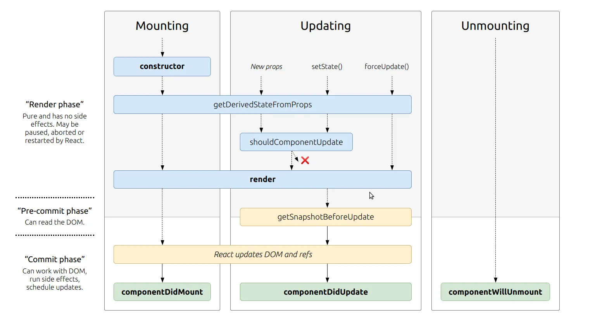

# State and Props 

## React Lifecycle 

In the diagram shown above we can see that **The Render** is what takes place before the *componentDidMount*.
**Mounting** is when an instance of a component is being created and inserted into the DOM. 

### React Lifecycle Order: 
1. Constructor
2. Render
3. componentDidMount
4. ReactUpdates 
5. componentWillUnmount

### `componentDidMount`

This method is invoked immediatey after a component is mounted. If you need to load anything using a network request or initialize the DOM, it should go here. This method is a good pace to set up any subscriptions. 

## Reacts State VS. Props 

| Props  |  State  |
|--------|---------|
|Passed into component from a parent | Managed inside the component |
| Immutable | Mutable | 
| Controlled externally | Controls dynamic behavior | 

In the props you can pass any data needed to configure a component, similar to arguments in a function. 

* A *component* re-renders when theres a main trigger or "state change" or when the props change. (As a side note: Updating state causes React to re-render that part of the UI). 

* State should store data that changes over time and affects the UI. A counter that increments form data that updates and user types. 